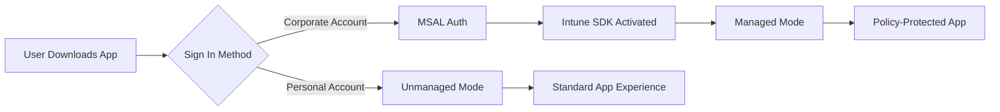
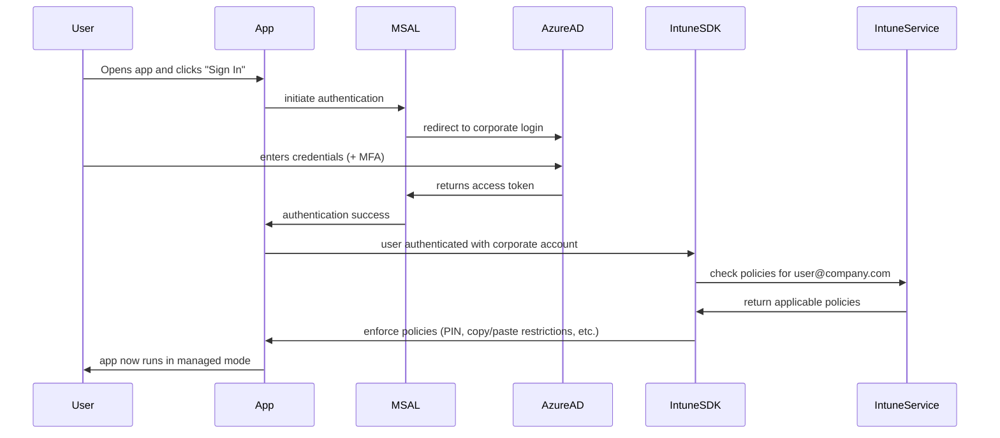

# Intune MAM React Native Integration

[](https://reactnative.dev/)
[](https://github.com/facebook/react-native)
[](LICENSE)
[](https://github.com/AzureAD/microsoft-authentication-library-for-js)

> 🔐 A comprehensive guide for integrating Microsoft Intune Mobile Application Management (MAM) with React Native apps for both iOS and Android platforms.

## 📋 Table of Contents

- [Overview](#overview)
- [Features](#features)
- [Prerequisites](#prerequisites)
- [Quick Start](#quick-start)
- [Installation](#installation)
- [Configuration](#configuration)
- [Understanding MSAL Authentication](#-understanding-msal-authentication)
- [Usage](#usage)
- [Deployment](#deployment)
- [Troubleshooting](#troubleshooting)
- [Contributing](#contributing)
- [Resources](#resources)

## 🔍 Overview

This repository provides a step-by-step implementation guide for integrating Microsoft Intune MAM into React Native applications. The solution enables **dual-mode functionality** where a single app published to public stores can serve both corporate and consumer users.

### How It Works



## ✨ Features

- 🏢 **Corporate Data Protection** - Automatic policy enforcement for enterprise users
- 👥 **Consumer Friendly** - No impact on regular app users
- 📱 **Cross-Platform** - Works on both iOS and Android
- 🔄 **Automatic Mode Switching** - Identity-based policy activation
- 🛡️ **Zero Trust Security** - Conditional access based on user identity
- 📦 **Single App Distribution** - One app for all user types

## 📋 Prerequisites

Before you begin, ensure you have:

- [ ] **Azure AD Premium** license
- [ ] **Microsoft Intune** license
- [ ] Administrative access to [Azure Portal](https://portal.azure.com)
- [ ] Access to [Microsoft Endpoint Manager](https://endpoint.microsoft.com)
- [ ] Apple Developer Program membership
- [ ] Google Play Developer account
- [ ] React Native development environment (RN 0.70+)

## 🚀 Quick Start

### 1. Clone and Install

```bash
# Clone your React Native project
git clone <your-react-native-project>
cd your-project

# Install required dependencies
npm install react-native-msal react-native-intune-mam --save

# Install iOS dependencies
cd ios && pod install && cd ..
```

### 2. Azure AD Setup

```bash
# Register your app in Azure AD
# Note: Use the Azure Portal UI for this step
echo "Register app at: https://portal.azure.com/#blade/Microsoft_AAD_RegisteredApps"
```

### 3. Basic Implementation

```javascript
// src/services/AuthService.js
import { PublicClientApplication } from 'react-native-msal';

const msalConfig = {
  auth: {
    clientId: 'YOUR_CLIENT_ID',
    authority: 'https://login.microsoftonline.com/YOUR_TENANT_ID',
  },
};

export const authService = new PublicClientApplication(msalConfig);
```

## 📦 Installation

### Dependencies

```json
{
  "dependencies": {
    "react-native-msal": "^4.0.0",
    "react-native-intune-mam": "^1.0.0"
  }
}
```

### Platform Setup

<details>
<summary><strong>iOS Configuration</strong></summary>

1. **Info.plist Setup**:
```xml
<key>CFBundleURLTypes</key>
<array>
    <dict>
        <key>CFBundleURLSchemes</key>
        <array>
            <string>msauth.com.yourcompany.appname</string>
        </array>
    </dict>
</array>
```

2. **Keychain Sharing**:
   - Enable in Xcode Capabilities
   - Add: `com.microsoft.adalcache`, `com.microsoft.intune.mam`

3. **Framework Integration**:
   - Download [Intune SDK for iOS](https://github.com/msintuneappsdk/ms-intune-app-sdk-ios)
   - Add frameworks to Xcode project

</details>

<details>
<summary><strong>Android Configuration</strong></summary>

1. **MSAL Config** (`android/app/src/main/res/raw/msal_config.json`):
```json
{
  "client_id": "YOUR_CLIENT_ID",
  "redirect_uri": "msauth://com.yourcompany.appname/SIGNATURE_HASH",
  "authorities": [{
    "type": "AAD",
    "audience": {
      "type": "AzureADMyOrg",
      "tenant_id": "YOUR_TENANT_ID"
    }
  }]
}
```

2. **Build Gradle**:
```gradle
dependencies {
    implementation 'com.microsoft.identity.client:msal:4.+'
}
```

</details>

## ⚙️ Configuration

### 1. Azure AD App Registration

| Setting | Value | Description |
|---------|-------|-------------|
| **Name** | `YourApp-ReactNative-Intune` | Descriptive app name |
| **Account Types** | Single tenant | Corporate users only |
| **iOS Redirect** | `msauth.com.yourcompany.app://auth` | iOS callback URL |
| **Android Redirect** | `msauth://com.yourcompany.app/HASH` | Android callback URL |

### 2. API Permissions

```bash
# Required permissions
Microsoft Graph:
  ✅ User.Read
  ✅ DeviceManagementManagedApps.ReadWrite
```

### 3. Intune App Protection Policy

```yaml
Policy Settings:
  Data Protection:
    - Prevent Save As: ✅
    - Restrict copy/paste: ✅
    - Encrypt app data: ✅
  
  Access Requirements:
    - PIN required: ✅
    - Biometric auth: ✅
  
  Conditional Launch:
    - Block jailbroken devices: ✅
    - Min OS version: iOS 14+, Android 10+
```

## � Understanding MSAL Authentication

### What is MSAL and Why is it Required for Intune?

**Microsoft Authentication Library (MSAL)** is a library that allows your application to integrate with the Microsoft identity platform. It's **essential** for Intune MAM because policies are applied based on the user's authenticated identity in Azure Active Directory.

#### Why MSAL is Critical for Intune Integration

1. **Identity Verification**: Your app must first determine *who* is using it. MSAL handles the sign-in process against your company's Azure AD.

2. **Policy Enrollment**: Once a user is successfully signed in, the Intune SDK uses their authenticated identity (specifically, their User Principal Name or UPN, like `user@yourcompany.com`) to communicate with the Microsoft Intune service.

3. **Policy Retrieval**: The Intune service checks if any App Protection Policies are assigned to that specific user or a group they belong to.

4. **Policy Enforcement**: If policies exist, the Intune service sends them to the SDK in your app, which then enforces the rules you configured.

> **Without MSAL**: The Intune SDK wouldn't know which user to check for policies, and no protection would be applied.

### The Authentication Flow Explained



### Token Types and Their Purpose

| Token Type | Purpose | Lifetime | Storage |
|------------|---------|----------|---------|
| **Access Token** | Proves user identity to APIs | 1 hour | Memory only |
| **Refresh Token** | Gets new access tokens | 90 days | Secure keychain |
| **ID Token** | Contains user profile info | 1 hour | Memory only |

### Silent vs Interactive Authentication

#### Silent Authentication
```javascript
// Attempt to get token without user interaction
const silentRequest = { 
  scopes: ['user.read', 'DeviceManagementManagedApps.ReadWrite'], 
  account: accounts[0] 
};
const result = await pca.acquireTokenSilent(silentRequest);
```

**When it works**: User already signed in, token still valid
**Benefits**: Seamless user experience, no interruption

#### Interactive Authentication
```javascript
// Requires user interaction (login screen)
const interactiveRequest = { 
  scopes: ['user.read', 'DeviceManagementManagedApps.ReadWrite'] 
};
const result = await pca.acquireToken(interactiveRequest);
```

**When needed**: First sign-in, token expired, or consent required
**Process**: Redirects to Azure AD login page

### Scope Permissions Explained

```javascript
const scopes = [
  'user.read',                           // Basic user profile
  'DeviceManagementManagedApps.ReadWrite' // Intune MAM communication
];
```

| Scope | Purpose | Required for Intune |
|-------|---------|-------------------|
| `user.read` | Access basic user profile information | Optional |
| `DeviceManagementManagedApps.ReadWrite` | Allow app to report status to Intune service | **Required** |

### Corporate vs Personal Account Handling

#### Corporate Account Flow (`user@company.com`)
1. User signs in with work email
2. MSAL redirects to company's Azure AD
3. User completes authentication (password + MFA)
4. **Intune SDK activates** and checks for policies
5. Policies are downloaded and enforced
6. App runs in **Managed Mode**

#### Personal Account Flow (`user@gmail.com`)
1. User signs in with personal email
2. MSAL authenticates against personal Microsoft account
3. **Intune SDK remains dormant** (no corporate identity)
4. App runs in **Unmanaged Mode**

### Error Handling Best Practices

```javascript
export const signIn = async () => {
  try {
    // Try silent first
    const accounts = await pca.getAccounts();
    if (accounts.length > 0) {
      try {
        return await pca.acquireTokenSilent({ scopes, account: accounts[0] });
      } catch (silentError) {
        // Silent failed, fall back to interactive
        console.log('Silent auth failed, trying interactive:', silentError.code);
      }
    }
    
    // Interactive authentication
    return await pca.acquireToken({ scopes });
  } catch (error) {
    // Handle specific error codes
    switch (error.code) {
      case 'user_cancelled':
        console.log('User cancelled authentication');
        break;
      case 'network_not_available':
        throw new Error('Network connection required for sign-in');
      case 'invalid_client':
        throw new Error('App configuration error. Check client ID.');
      default:
        console.error('Authentication error:', error);
        throw new Error('Authentication failed. Please try again.');
    }
  }
};
```

### Security Considerations

#### Token Storage
- **Access tokens**: Stored in memory only
- **Refresh tokens**: Stored in secure keychain (iOS) or keystore (Android)
- **Never**: Store tokens in plain text or shared preferences

#### Network Security
```javascript
// Always use HTTPS for token requests
const msalConfig = {
  auth: {
    authority: 'https://login.microsoftonline.com/YOUR_TENANT_ID', // ✅ HTTPS
    // authority: 'http://...' // ❌ Never use HTTP
  },
};
```

#### Certificate Pinning (Advanced)
```javascript
// Implement certificate pinning for production apps
const networkConfig = {
  certificatePinning: {
    'login.microsoftonline.com': ['sha256/CERTIFICATE_HASH']
  }
};
```

## �💻 Usage

### Authentication Service

```javascript
// src/services/AuthService.js
import { PublicClientApplication } from 'react-native-msal';

const msalConfig = {
  auth: {
    clientId: process.env.AZURE_CLIENT_ID,
    authority: `https://login.microsoftonline.com/${process.env.AZURE_TENANT_ID}`,
    redirectUri: Platform.select({
      ios: 'msauth.com.yourcompany.app://auth',
      android: 'msauth://com.yourcompany.app/YOUR_SIGNATURE_HASH',
    }),
  },
};

const pca = new PublicClientApplication(msalConfig);
const scopes = ['user.read', 'DeviceManagementManagedApps.ReadWrite'];

export const signIn = async () => {
  try {
    // Try silent authentication first
    const accounts = await pca.getAccounts();
    if (accounts.length > 0) {
      return await pca.acquireTokenSilent({ scopes, account: accounts[0] });
    }
    
    // Fall back to interactive authentication
    return await pca.acquireToken({ scopes });
  } catch (error) {
    console.error('Authentication failed:', error);
    throw error;
  }
};

export const signOut = async () => {
  const accounts = await pca.getAccounts();
  if (accounts.length > 0) {
    await pca.removeAccount(accounts[0]);
  }
};
```

### Login Component

```javascript
// src/components/LoginScreen.js
import React, { useState, useEffect } from 'react';
import { View, Text, TouchableOpacity, Alert } from 'react-native';
import { signIn, signOut } from '../services/AuthService';

const LoginScreen = () => {
  const [user, setUser] = useState(null);
  const [loading, setLoading] = useState(false);

  const handleSignIn = async () => {
    setLoading(true);
    try {
      const result = await signIn();
      setUser(result.account);
      Alert.alert('Success', `Welcome ${result.account.name}!`);
    } catch (error) {
      Alert.alert('Error', 'Authentication failed');
    } finally {
      setLoading(false);
    }
  };

  const handleSignOut = async () => {
    try {
      await signOut();
      setUser(null);
      Alert.alert('Success', 'Signed out successfully');
    } catch (error) {
      Alert.alert('Error', 'Sign out failed');
    }
  };

  return (
    <View style={styles.container}>
      {user ? (
        <UserProfile user={user} onSignOut={handleSignOut} />
      ) : (
        <SignInButton onPress={handleSignIn} loading={loading} />
      )}
    </View>
  );
};

const UserProfile = ({ user, onSignOut }) => (
  <View style={styles.profile}>
    <Text style={styles.welcome}>Welcome, {user.name}!</Text>
    <Text style={styles.email}>{user.username}</Text>
    <TouchableOpacity style={styles.button} onPress={onSignOut}>
      <Text style={styles.buttonText}>Sign Out</Text>
    </TouchableOpacity>
  </View>
);

const SignInButton = ({ onPress, loading }) => (
  <View style={styles.signIn}>
    <Text style={styles.title}>Corporate Access</Text>
    <Text style={styles.subtitle}>Sign in with your work account</Text>
    <TouchableOpacity 
      style={[styles.button, loading && styles.buttonDisabled]} 
      onPress={onPress}
      disabled={loading}
    >
      <Text style={styles.buttonText}>
        {loading ? 'Signing in...' : 'Sign In'}
      </Text>
    </TouchableOpacity>
  </View>
);

const styles = {
  container: { flex: 1, justifyContent: 'center', padding: 20 },
  profile: { alignItems: 'center' },
  signIn: { alignItems: 'center' },
  welcome: { fontSize: 24, fontWeight: 'bold', marginBottom: 10 },
  email: { fontSize: 16, color: '#666', marginBottom: 20 },
  title: { fontSize: 20, fontWeight: 'bold', marginBottom: 10 },
  subtitle: { fontSize: 16, color: '#666', marginBottom: 30 },
  button: { 
    backgroundColor: '#0078D4', 
    padding: 15, 
    borderRadius: 5,
    minWidth: 120,
    alignItems: 'center'
  },
  buttonDisabled: { backgroundColor: '#ccc' },
  buttonText: { color: 'white', fontWeight: 'bold' },
};

export default LoginScreen;
```

### Environment Configuration

```bash
# .env
AZURE_CLIENT_ID=your-client-id-here
AZURE_TENANT_ID=your-tenant-id-here
```

## 🚢 Deployment

### Build Process

#### iOS
```bash
# Build and archive
cd ios
xcodebuild -workspace YourApp.xcworkspace -scheme YourApp archive
```

#### Android
```bash
# Generate release APK
cd android
./gradlew assembleRelease

# Apply Intune MAM wrapper
java -jar IntuneMAMAppPackager.jar \
  -i app-release.apk \
  -o app-release-intune.apk \
  -a ADAL_settings.json \
  -v
```

### Store Distribution

| Platform | File | Store |
|----------|------|-------|
| **iOS** | `.ipa` archive | Apple App Store |
| **Android** | `*-intune.apk` | Google Play Store |

> ⚠️ **Important**: For Android, always upload the Intune-wrapped APK to the store.

## 🛠️ Troubleshooting

### Common Issues

<details>
<summary><strong>Authentication Fails</strong></summary>

**Symptoms**: MSAL throws authentication errors

**Solutions**:
- ✅ Verify redirect URIs match Azure AD configuration
- ✅ Check signature hash generation for Android
- ✅ Ensure keychain sharing is enabled (iOS)
- ✅ Validate client ID and tenant ID

```javascript
// Debug authentication
const debugAuth = async () => {
  try {
    const accounts = await pca.getAccounts();
    console.log('Existing accounts:', accounts);
  } catch (error) {
    console.error('Auth debug error:', error);
  }
};
```

</details>

<details>
<summary><strong>Policies Not Applying</strong></summary>

**Symptoms**: Corporate users not seeing policy enforcement

**Solutions**:
- ✅ Verify user is in assigned Azure AD group
- ✅ Check Bundle ID/Package Name matches policy
- ✅ Confirm user has Intune license
- ✅ Test with known working corporate account

```bash
# Verify policy assignment
echo "Check: Endpoint Manager > Apps > App protection policies"
```

</details>

<details>
<summary><strong>Build Failures</strong></summary>

**iOS Issues**:
- ✅ Framework linking problems → Check Xcode project settings
- ✅ Keychain access → Verify capabilities configuration
- ✅ Code signing → Update provisioning profiles

**Android Issues**:
- ✅ APK packaging fails → Update Intune App Packager
- ✅ Signature hash → Regenerate using correct keystore
- ✅ MSAL config → Validate JSON syntax

</details>

### Debug Mode

```javascript
// Enable MSAL logging
const msalConfig = {
  auth: { /* ... */ },
  system: {
    loggerOptions: {
      loggerCallback: (level, message, containsPii) => {
        console.log(`MSAL [${level}]: ${message}`);
      },
      piiLoggingEnabled: false,
      logLevel: 'Verbose', // Error, Warning, Info, Verbose
    },
  },
};
```

## 🤝 Contributing

We welcome contributions! Please see our [Contributing Guide](CONTRIBUTING.md) for details.

### Development Setup

```bash
# Clone the repository
git clone https://github.com/your-org/intune-mam-react-native.git
cd intune-mam-react-native

# Install dependencies
npm install

# Run the example app
npx react-native run-ios
# or
npx react-native run-android
```

### Testing

```bash
# Run tests
npm test

# Run E2E tests
npm run e2e:ios
npm run e2e:android
```

## 📚 Resources

### Official Documentation
- [Microsoft Intune App SDK for iOS](https://docs.microsoft.com/en-us/mem/intune/developer/app-sdk-ios)
- [Microsoft Intune App SDK for Android](https://docs.microsoft.com/en-us/mem/intune/developer/app-sdk-android)
- [MSAL React Native Documentation](https://github.com/AzureAD/microsoft-authentication-library-for-js/tree/dev/lib/msal-react-native)

### Tools & Utilities
- [Azure Portal](https://portal.azure.com) - Azure AD Management
- [Microsoft Endpoint Manager](https://endpoint.microsoft.com) - Intune Policies
- [Microsoft Graph Explorer](https://developer.microsoft.com/graph/graph-explorer) - API Testing

### Community
- [react-native-msal](https://www.npmjs.com/package/react-native-msal) - Community MSAL wrapper
- [Stack Overflow](https://stackoverflow.com/questions/tagged/microsoft-intune) - Community support
- [Microsoft Tech Community](https://techcommunity.microsoft.com/t5/microsoft-intune/ct-p/MicrosoftIntune) - Official community

## 📄 License

This project is licensed under the MIT License - see the [LICENSE](LICENSE) file for details.

## 🙏 Acknowledgments

- Microsoft Intune Team for the comprehensive SDK documentation
- React Native community for the excellent MSAL integration
- All contributors who have helped improve this guide

---

<div align="center">
  <p>
    <strong>Built with ❤️ for the React Native & Microsoft Intune community</strong>
  </p>
  <p>
    <a href="#top">Back to top</a>
  </p>
</div>
